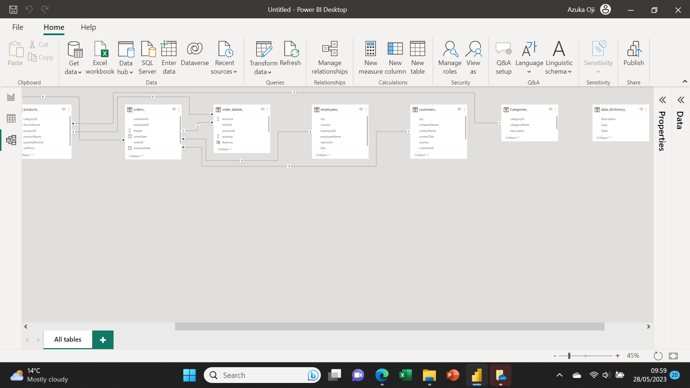
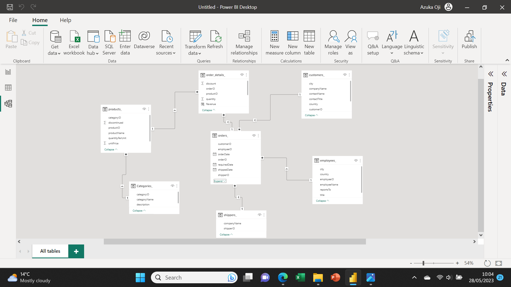

# NORTHWIND-TRADER-SALES

## Introduction
As part of its usual monthly routine, **Maven Analytics** organised a challenge where it made available datasets for analysis (May edition). Being someone who loves to constantly improve on himself and also stay intouch with the "skills", I decided to participate in the challenge. The dataset, a csv file contained multiple table data structure with 2985 records 28 fields. Power BI was used for the analysis.

## Problem Statement
Although top KPI metrics such as sales trend, Company's product performance, key customers and general shipping costs were looked at. However, emphasis was placed on identifying ways of improving and strengthening the company's revenue performance while still delivering value to customers. 

## Data Transformation/Cleaning
I imported the datasets into my Power BI desktop from whence I loaded them to the Power Query Editor. To ensure data quality, I cleaned and transformed the raw csv file by doing the following on Power Query Editor:

- Ensured column profiling based on entire dataset
- Removed Duplicated records
- Created new columns, some of which are the **OrderDate-Month, OrderDate-Year, and OrderDate-Day of Week**; all in the Orders table. All these I created using the **Transform** function.
- I checked the column quality to ensure there were no error or empty cells.
- Changed the column datatypes to the correct corresponding datatypes

  
## Data Modelling
Data modelling was incoporated in the analysis as there were 7 tables (1 fact table, 5 dimension tables and 1 data dictionary). By default, relationships were auto created and tables arranged linearly. However, I created new relationships and proceeded to arrange the tables in a star schema model. The before and after images can be seen below.

Before Model                       |                         After Model
:---------------------------------:|:--------------------------------------:
                    |      

## Visualization
Having done the necessary cleaning and transformation, I loaded the datasets into my Power BI destop for analysis and dashboard creation. Below is the generated report.

For an interactive view of this dashboard, see [here](https://app.powerbi.com/groups/me/reports/92aa89ed-9615-4a6c-b406-620b7f3ed9de/ReportSection?experience=power-bi) 

Also, for further details and insights generated from this Project, see [here](https://mavenanalytics.io/project/6132)

## Conclusion & Recommendation
The visual was able to show the top performing customers, Products, Product category and locations. It also showed that the company's revenue generation had a steady rise from July 2013 till the 1st quarter of 2015, nosediving afterwards. To boost revenue generation, the company was advised to do the following:
- carry out a market basket analysis to identify customer purchase pattern
- Top category products should always be in stock especially in top performing location
- Negotiate a downward review of the freight costs of the top freight company
- Reward top performing employees
- Improve general working conditions
